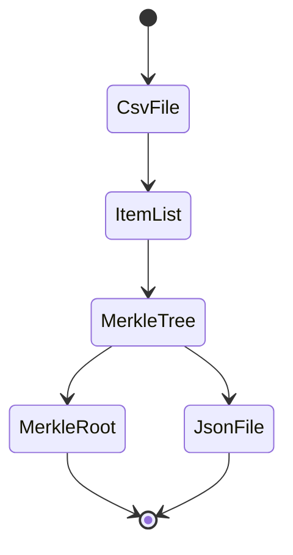

# White list , Merkle tree , Solidity and Dapp


**_La petite histoire sous-jacente à ce petit projet de demonstration :_**
Vous êtes le développeur d'un projet de NFT en charge de toute la partie technique, et les gars du marketing vous envoie un fichier
excel contenant les adresses et le nombre de NFT possible à mint par personne.

Dans cette page nous allons aborder différentes notions afin de comprendre et résoudre le problème qui nous est posé.

## Comment limiter l'accès à une méthode de votre "smartcontract" à certaine adresses

### Solidity mapping
Un technique simple et efficace serait de créer un simple mapping _allowlist_ au niveau du smart contract qui nous permettrait de stocker l'adresse et le nombre de NFT possible à minter, et d'y ajouter par script le contenu du fichier excel.
Cela est possible fonctionne bien, mais reste relativement couteux en gaz et nécessite en cas de volumes importants de faire un traitement par lots afin d'éviter le OOG (out of gaz )

**ps** : nous n'allons pas retenir cette solution pour notre demonstration.

### L'abre de Merkle

L'autre approche est d'utiliser l'arbre de "merkle", dont je vais résumer le principe simplement :
<br/>
C'est une technique qui permet à partir de l'association des membres d'une liste, de créer une clé de validation globale("la merkle root"), et une clé (preuve) pour chaque élément de la liste.
La correspondance de ces deux éléments pouvant être validé mathématiquement.

**ps** : libre à vous d'aller vous instruire sur les merveilles mathématiques qui se cachent derrière cette triste simplification.(cf. Ressources)

Tout l'intérêt de cette approche, c'est qu'il nous suffit maintenant de stocker un simple clé la "merkleRoot" sur notre smart contract, ce qui est économiquement bien plus rentable.
Ce qui a aussi secondairement l'avantage de ne pas rendre la liste des White liste publique sur la blockchain.

## Comment générer la "merkle root" et les preuves pour chaque adresse.



### Du fichier CSV vers la liste d'objets javascript

Dans le **[ scrit : processWl.js](./scripts/processWl.js)**, vous pouvez trouver l'exemple pour le faire à partir d'un fichier CSV.

```javascript
    const fs = require("fs");
    const readline = require("readline");
   
    const SEPARATOR = ";";
    const csvInFile = __dirname + '/wl.csv';

    // parse the CSV file and create a memory list from it
    const fileStream = fs.createReadStream(csvInFile);
    const rl = readline.createInterface({
        input: fileStream,
        crlfDelay: Infinity
    });
    const items = [];
    for await (const line of rl) {
        const cells =  line.split(SEPARATOR);
        items.push({address: cells[0],quantity: cells[1] });
    }
```

La liste d'objet obtenue aura ainsi cette forme
```javascript
[
    {address:'ox..',quantity: 2 },
    ...
]
```

### De la liste d'objets vers l'arbre de "merkle"

Comme souvent nous allons utiliser le travail des autres pour parvenir à nos fins, la bibliothèque **[merkletreejs](https://github.com/miguelmota/merkletreejs)**
va nous permettre de réaliser ceci simplement.

Dans ce projet vous trouverez aussi une classe de ma composition permettant d'abstraire et donc de simplifier encore plus le processus :
<br/>**[classe : MerkleCalculator.js](./scripts/MerkleCalculator.js)**


```javascript
    const MerkleCalculator = require("./MerkleCalculator");    
    
    const calculator = new MerkleCalculator();
    calculator.processList(items);
    
    // we generate the dapp file
    items.map( it => {
        it.proof =  calculator.getProof(it.address);
    });
    console.log(`Root key ${calculator.root} `);
```

### De l'arbre de "merkle" vers le fichier Json

```javascript
   const jsonOutFile = __dirname + '/wl.json';
    console.log(`Root key for the smart contract :${calculator.root} `);
    fs.writeFileSync(jsonOutFile, JSON.stringify(items));
    
    // outputs
    console.log(`Dapp file generated  :${jsonOutFile} `);
    console.log(`Root key for the smart contract :${calculator.root} `);
```

Ce fichier "wl.json" pourra être envoyé vers le Dapp, il contient l'ensemble des informations nécessaire pour appeler le smart contrat
et permettre d'afficher à l'utilisateur, s'il est WL ou non, et la quantité de NFT qu'ils vont mint.

Un exemple fonctionnel est disponible dans ce projet : ```npx hardhat run scripts/processWl.js```


## et coté smart contract ?

### Comment implementer la validation dans le smart contract.

Comme souvent nous allons utiliser le travail des autres pour parvenir à nos fins , la légendaire équipe d'"openzepellin" ayant encore une fois mis tous les élements à notre disposition.
Le contenu  de  ``` "@openzeppelin/contracts/utils/cryptography/MerkleProof.sol"; ``` nous permettant d'accéder à la méthode miracle :

```solidity
    MerkleProof.verify(proof, merkleRoot, leaf)
```
<br/>Le principe est le suivant :
l'utilisateur va se connecter et récupérer (à partir du fichier généré ci-dessus) les informations dont il a besoin : sa quantité autorisée et sa preuve.

le smart contract va encoder l'information de l'adresse de l'appelant (``` msg.sender ```) et de la quantité passée comme argument, il va ainsi pouvoir avoir la chaine de caractère représentant **la feuille**, dans l'arbre de merkle.
@openzeppelin nous offre une méthode qui nous permet de justement valider une feuille en prenant en compte  : **la clé de l'arbre** et **la preuve** généré par la feuille.
ce qui nous donne :

```solidity
  function preSaleMint(uint256 quantity, bytes32[] memory proof) external {

        bytes32 leaf = keccak256(abi.encode(msg.sender, quantity));
        require(MerkleProof.verify(proof, merkleRoot, leaf), "PROOF_NOT_VALID");
        
        // etc .. 
    }
```

> :warning: **La sécurité de cette méthode**  reposent sur le fait que pour calculer la feuille coté smart contract on utilise l'adresse de l'appelant : **msg.sender**, toute divergence par rapport à cette pratique nécessiterait d'avoir l'absolue certitude de ce que vous être en train de faire.


### Comment ajouter ce point dans nos tests unitaires

Il ne faut bien sur pas oublier que tester  ( si les risques sont élévés est une obligation )
Ansi dans hardhat vous pouvez tester le focntionnement de ce processus comme suit :

```javascript
    const [owner, user1, wl1, wl2, wl3] = await hre.ethers.getSigners();
    const merkleCalculator = new MerkleCalculator();
    const wlAddresses = [
        {address: wl1.address, quantity: 1},
        {address: wl2.address, quantity: 2},
        {address: wl3.address, quantity: 3}
    ];
    merkleCalculator.processList(wlAddresses);

    it("expect preSaleMint should be revert for none Wl users ", async () => {
        await expect(contract.connect(user1).preSaleMint(1, [])).to.be.revertedWith('PROOF_NOT_VALID');
    });

    it("expect preSaleMint to assign 1 to wl1 user  ", async () => {
        await contract.connect(wl1).preSaleMint(1, merkleCalculator.getProof(wl1.address))
        expect(await contract.numberMinted(wl1.address) === 1);
    });

    it("expect preSaleMint to assign 3 to wl3 user  ", async () => {
        await contract.connect(wl3).preSaleMint(3, merkleCalculator.getProof(wl3.address))
        expect(await contract.numberMinted(wl3.address) === 3);
    });


```

Un exemple fonctionnel est disponible dans ce projet :  ``` npx hardhat test ```


# Ressources

## links


- [Explication du focntionnement de l'arbre de merkle](https://brilliant.org/wiki/merkle-tree/)
- [La bibliothèque javascirpt : merkletreejs](https://www.npmjs.com/package/merkletreejs)
- [La doc d'open zeppelin sur le sujet](https://docs.openzeppelin.com/contracts/3.x/api/cryptography)


##images

Image par <a href="https://pixabay.com/fr/users/thedigitalartist-202249/?utm_source=link-attribution&amp;utm_medium=referral&amp;utm_campaign=image&amp;utm_content=1777917">Pete Linforth</a> de <a href="https://pixabay.com/fr/?utm_source=link-attribution&amp;utm_medium=referral&amp;utm_campaign=image&amp;utm_content=1777917">Pixabay</a>