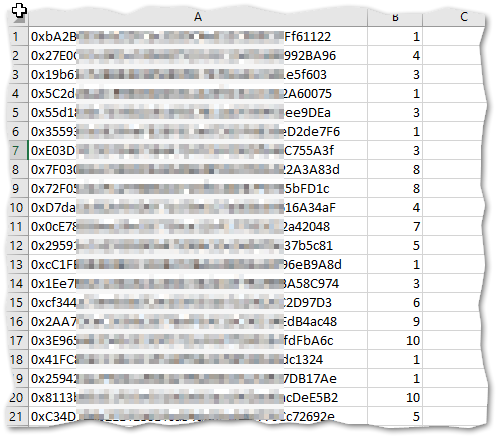

# White list , Merkle tree , Solidity and Dapp

Que de mots dans ce titre  agicheur  , résumons ici ce qui est décit dans lignes de cette article.

**_La petite histoire sous jacente à ce petit projet de démontration :_** 
Vous êtes le développeur d'un projet de NFT en charge de tout la partie technique , et les gars du marketing vous shoot un fichier 
excel contenant les adresses et le nombre de NFT  possible à mint par personne.




A partir ce cette petite mise en bouche nous allons explorer le pourquoi et le comment de ce besoin.


## Comment limiter l'accès à une méthode de votre "smartcontract" à certaine adresses

### Solidity mapping 
Un technique simple et efficace serait de créer un simple mapping _allowlist_, et d'y ajouter sans hésitations le contenu de votre fichier excel. 
Cela est possible , focntionne bien mais reste relativement couteux en gaz et vous nécéssite en cas de volumes importants de faire un traitement par lot pour éviter le OOG (out of gaz )

ps : nous n'allons pas retenir cette solution pour notre démontration.

### Merkle tree

l'autre approche est d'utiliser le merkel tree , dont je vais résumer le principe simplement ( peux-être trop )
c'est une technique qui permet à partir d'une liste de
- Générer un clé globale
- une preuve par élement de la liste.
la combinaison de ces deux élements pouvant être validé mathématiquement, prouvant indéniablement que l'élément fait partie de la liste.

ps : libre à vous d'aller vous instruire sur les merveilles mathématiques qui se cachent  derrière cette triste restitution.(cf. Ressources)

Tout l'intérêt de cette approche c'est qu'il nous suffit maintenant de stocker un simple clé la "merkleRoot" sur notre smart contract ,
ce qui est économiquement bien plus profitable.
Ce qui à aussi  secondairement l'avantage de ne pas rendre la liste des White liste ancrée à tout jamais dans la blockchain

# Comment générer la "merkle root" et les preuves pour chaque addresse. 

Comme souvent nous allons utiliser le travail des autres pour parvenir à nos fins, la bibliothèque [merkletreejs](https://github.com/miguelmota/merkletreejs)
va nous pemettre de réaliser ceci simplement sans jamais avoir à effleurer toutes les complexités mathématiques cachées.

je me suis même permis d'ajouter une couche pour masquer encore plus la compléxité  : **[MerkleCalculator.js](./scripts/MerkleCalculator.js)**

le principe est de préparer une liste d'objet en javascript ressemblant à ça :
```javascript
[
    {address:'ox..',quantity: 2 },
    ...
]
```
Ps : Dans le **[processWl.js](./scripts/processWl.js)**, vous pouvez trouver l'exeple pour le faire à partir d'un fichier CSV.

lors du traitement de la liste on va 
- Encoder chaque objet de la liste afin d'avoir une représentation sur forme de chaine de cararctère , on obtiendra ainsi une feuille de l'arbre
- Lancer la mécanique "merkle" pour calculer les preuves de chaque feuille  et la clé finale, qui permettra de valider chaque feuille.

```javascript
    const calculator = new MerkleCalculator();
    calculator.processList(items);
    
    // we generate the dapp file
    items.map( it => {
        it.proof =  calculator.getProof(it.address);
    });
    console.log(`Root key ${calculator.root} `);
```

Mon approche consiste à partir de cette classe de créer un object JSON , que je stocke dans un fichier et qui permettra à partir du Dapp d'envoyer les 
bonnes informations. 
```javascript
    fs.writeFileSync(jsonOutFile, JSON.stringify(items));

    // outputs
    console.log(`Dapp file generated  :${jsonOutFile} `);
    console.log(`Root key for the smart contract :${calculator.root} `);
```

# Comment implemémenter et tester la validation par le merkle tree dans le smart contract .

Comme souvent nous allons utiliser le travail des autres pour parvenir à nos fins , la légendaire équipe d'"openzepellin" ayant encore une fois mis tous les élements à notre disposition.
Le contenu  de  ``` "@openzeppelin/contracts/utils/cryptography/MerkleProof.sol"; ``` nous permettant d'accéder à la méthode miracle : 

```solidity
    MerkleProof.verify(proof, merkleRoot, leaf)
```

Détaillons un peu quel est le fonctionnement, et les paramètres de cette focntion. 
le prinicpe est le suivant l'utilsateur va fournir la preuve 


# Ressources 

## links 


##images 

thanks :
<a href="https://pixabay.com/fr/users/denisdoukhan-607002/?utm_source=link-attribution&amp;utm_medium=referral&amp;utm_campaign=image&amp;utm_content=1164424">Denis Doukhan</a> de <a href="https://pixabay.com/fr/?utm_source=link-attribution&amp;utm_medium=referral&amp;utm_campaign=image&amp;utm_content=1164424">Pixabay</a>
